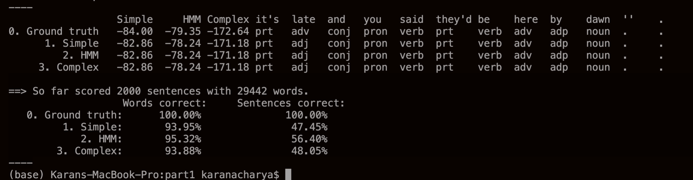

# Part-of-speech tagging

## Approach

- Using the given training corpus, we calculate all the probabilities and other parameters which we'll be used to predict on a test set sentence.
- For each model, we predict using those pre-computed parameters and the given corresponding Bayes' Net architectures.
- For each word in the sentence, the tag will be predicted using each of the 3 models - Simple, HMM and Complex.

## Training the models

- We calculate all the possible parameters which we'll be required during inferences using all the 3 models.  
    Following is the approach:
    1. The same word can appear in the corpus as different POS tags. Hence, we calculate the number of times each unique word appears in the corpus classified by it's tag. (Stored in the dict: **vocabulary**). It'll look something like this:  
    ```{'word1': {'noun': 3, 'verb': 1}, 'word2':{'det': 12, 'x': 3}}```  
    2. Next, we calculate the transition counts and probabilities. This will store the counts of each tag followed by each tag and the corresponding probabilities respectively. These will be used by all the 3 models.
    3. Next, similarly the emission counts and probabilities. The counts and probabilities of each word in the training corpus given it's corresponding tag. These will also be used by all the 3 models.
    4. Similarly, we create 4 new dictionaries: **skip_emissions, skip_transitions, skip_emission_probs, and skip_transition_probs**. These will store the counts and probabilites of a each tag also being a child of it's grandparent, and each word being also a child of it's previous tag. These are required only for the *Complex* model.
    5. While calculating all the emissions - the normal and the skip, there are obvious instances where a word may not be associated with each of the 12 tags. e.g. The word *India* can only be a *noun*, and hence we can calculate the emission probability for this word being a noun being equal to the number of times the word appeared as a noun divided by the number of total noun instances. The emission probability of this word given other tags should be very low, hence we set an **alpha** value (0.01) as the count, and then calculate it's emission prob - which will be very low as compared to the *noun* tag. **In other words, we're penalising the probabilities for the words given a tag for which we know it has a very low chance of existing in reality**. (This is similar to the concept of [Laplace smoothing](https://towardsdatascience.com/laplace-smoothing-in-na%C3%AFve-bayes-algorithm-9c237a8bdece).)
    6. Next, we also calculate the prior probabilities of each of the 12 tags and store it in the dict **priors**.
- In summary, the training phase will only consist of creating and computing the dictionaries with probability parameters which would be used later while inferencing.

## Inference + Solution

### 1. Simple Bayes Net

- The idea for making predictions using the Simple Bayes Net in fig. 1(b) is as follows:
    1. There exist links only from a tag to it's corresponding word. No other links exist between successive tags and/or words.
    2. Thus, each word-tag pair is independent of every other pair. To predict the posterior probability of each tag given it's corresponding word, we use Bayes' Law.
    3. The output prediction for each word will be the argmax of the product of it's emission and prior probabilities. For words not in the training corpus, we simply use the priors and ignore the non-existent emission probability for that word. (We initially tried using a logic similar to the *Laplace idea* mentioned above, but it was giving poorer results, and hence we scrapped it.)

### 2. Using the Viterbi algorithm on HMM

- Here, as can be seen in fig. 1(a), we have richer dependencies between sucessive tags. It's a Hidden Markov Model and hence we can use the Viterbi algorithm which uses dynamic programming to find the most likely sequence of unobserved variables given observed variables.
- In the vanilla version of the algorithm, we fill the probability value directly in the Viterbi Table. As the sequence length increases, there's a possibility that the numbers will become 0 as the values become way way smaller. To avoid that pitfall, we use the logarithm of the values. (We still maximise, as we are using the positive log). All the products become sums.
- Initially only the 1st column is filled. And then every column until the last one is filled. With each filled value, we also store an integer value indicating the row which provided this value with the maximum. This will be later used when backtracking to find the path.
- For words not in the vocabulary, we don't consider the emission probabilities for those words and just the priors or the other terms are used. (Again here, we tried with using an estimate of an emission prob using the *Laplace* logic, but it was grossly underestimating the value for each tag. Ignoring the value completely led to better results.)
- Once the table is filled, we select the row in the last column with the max value and assign the tag for the last word corresponding to that row number. For all other columns, we simply use the integer value stored to trace back to the first word.

### 3. Complex model using MCMC-Gibbs Sampling

- Here, we perform Gibbs Sampling based on the Bayes' Net design given in fig. 1(c). This design involves transition links between alternate tags and emission links between a tag and it's next word as well. The sampling will be performed for each sentence in the test set.
- We referred to the lecture slides and the following additional webpages for in-depth understanding of the concept: [Link 1](http://vision.psych.umn.edu/users/schrater/schrater_lab/courses/AI2/gibbs.pdf), [Link 2](https://www.cs.mcgill.ca/~dprecup/courses/ML/Lectures/ml-lecture08.pdf) and [Link 3](https://personal.utdallas.edu/~nrr150130/cs6347/2017sp/lects/Lecture_10_MCMC.pdf).
- The tags are the unobserved variables and the words are the observed variables. Following is the algorithm:  
    For each sentence,
    1. Initialise the 1st sample with random assignment of tags for each word in that sentence. (*We also tried by starting with a assignment of 'noun' for each tag. It had minimal difference in the final output.*)
    2. For n iterations,
        1. Assign the current sample to be the most recent one from the main list of samples.
        2. Pick an unobserved variable uniformly randomly. (*We can also run through all the tags(= length of sentence) in every iteration - this was how it was taught in the class. But this was taking a lot of computational time.*)
        3.  Sample Si from P(Si | S0, S1,...Si-1, Si+1, Si+2, ... Sn-1). We need to eliminate some variables. A variable is conditionally independent of all others given its Markov blanket (parents, children, spouses). Hence, when sampling we eliminate all others and just consider the probabilities associated with that variable. e.g. For S0, it doesn't have any parents. It's children are: W0, W1, S1, S2. Hence, we sample S0 based on only P(W0|S0), P(W1|S1), P(S1|S0), P(S2|S0) - These are the associated links for S0.
        4. Also depending on the variable being sampled, it may/may not have all parents and/or all children. These edge cases were considered. Please look at the code for better understanding. Again, for words not present in the training vocabulary, we didn't consider their non-existent emission probability.
        5. While sampling that variable, we consider all it's 12 possibilities corresponding to each tag. So, as if by flipping a 12-sided weighted biased coin, we assign a value to that variable while keeping the values of all other variables constant.
        6. This new sample is added to the main list of samples.
    3. The main list of n samples contains n tags for each word in the sentence. For every word, we just select the one that occurs the most and assign it as our prediction for that word.

## Conclusion

- The program completes under 10 minutes when run on the test set: *bc.test*. Following are the final results:



- As evident from the results, the HMM model performs slightly better than the not-so-far-behind Complex and Simple models.

<hr/>
